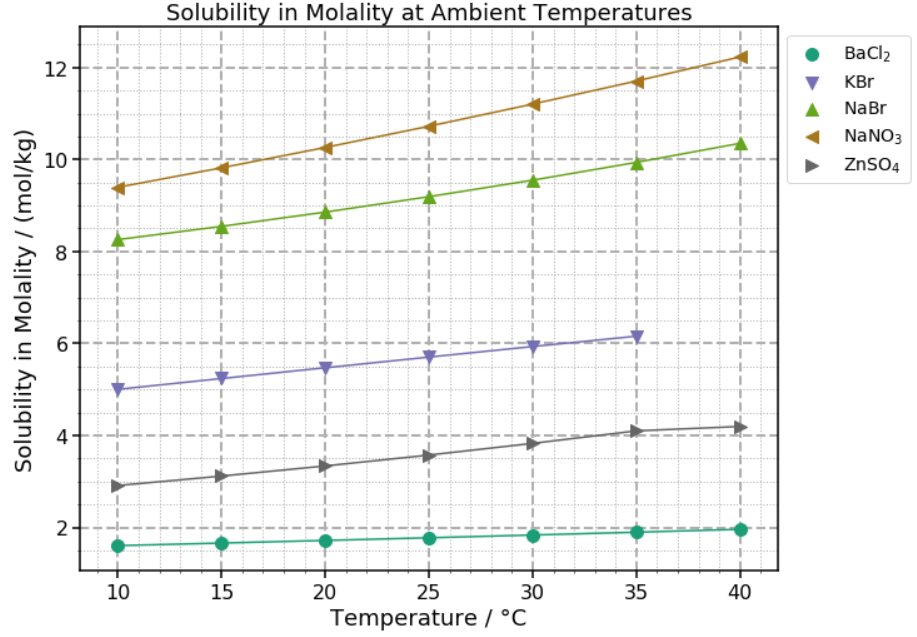

# Solutions

Solubility and concentration database of common chemical substances.

## Data available

- Solubility of common salts at ambient temperatures. Solubility values are
given in molality terms and temperature values in celsius. Reference: Rumble, J.
_CRC Handbook of Chemistry and Physics_, 98th Edition, CRC Press LLC, 2017.
[[Data]](data/molality_common_salts_ambient_temperatures.csv)
[[Tutorial]](tutorials/molality_salts_ambient_temperatures.ipynb)

- Aqueous solubility of 316 inorganic compounds at various temperatures.
Solubility values are expressed as mass percent of solute. Reference: Rumble, J.
_CRC Handbook of Chemistry and Physics_, 98th Edition, CRC Press LLC, 2017.
[[Data]](data/aqueous_solubility_inorganic_temperatures.csv)
[[Tutorial]](tutorials/aqueous_solubility_inorganic_temperatures.ipynb)

## Installation

Just clone or download this repo. This is not a package (yet, maybe someday :-))

## Usage

See the tutorials files for each data set.

## Under the hood - requirements

This project relies mainly on Pandas, SciPy, Matplotlib and numpy.

## Contributing

All contributions are welcome.

**Issues**

Feel free to submit issues regarding:

- recommendations
- more examples for the tutorial
- enhancement requests and new useful features
- code bugs

**Pull requests**

- before starting to work on your pull request, please submit an issue first
- fork the repo
- clone the project to your own machine
- commit changes to your own branch
- push your work back up to your fork
- submit a pull request so that your changes can be reviewed

## License

MIT, see [LICENSE](LICENSE)

## Citing

If you use this project in a scientific publication or in classes, please
consider citing as

F. L. S. Bustamante, *Solutions* - Solubility and concentration database of
common chemical substances., 2020 - Available at:
https://github.com/chicolucio/solutions